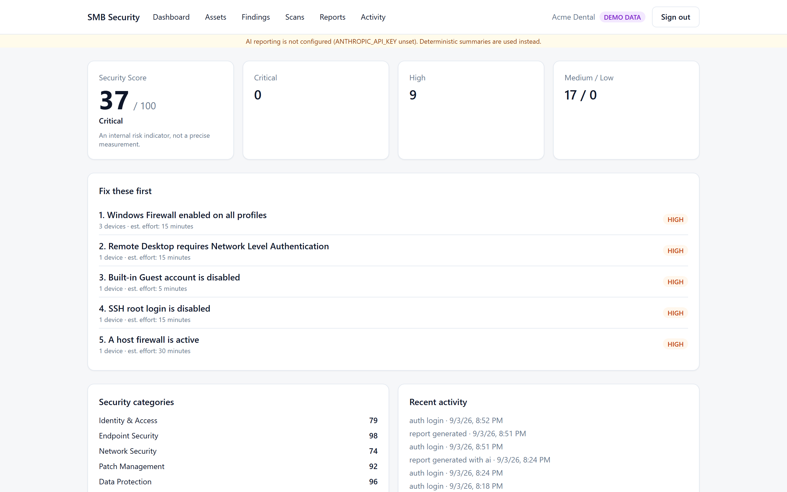
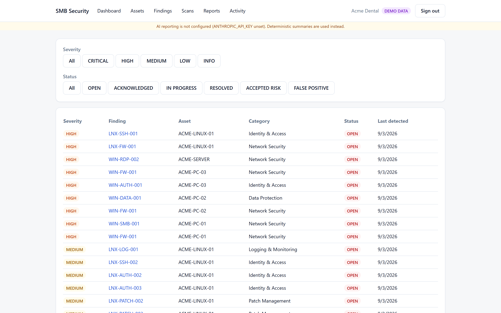
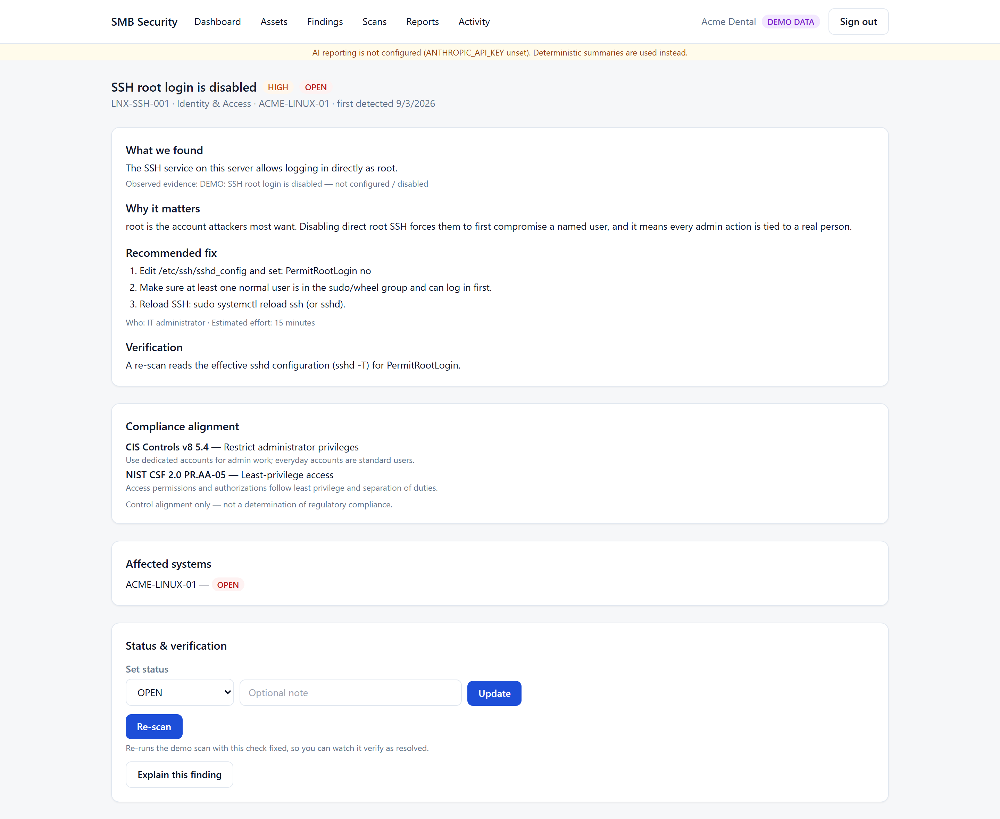
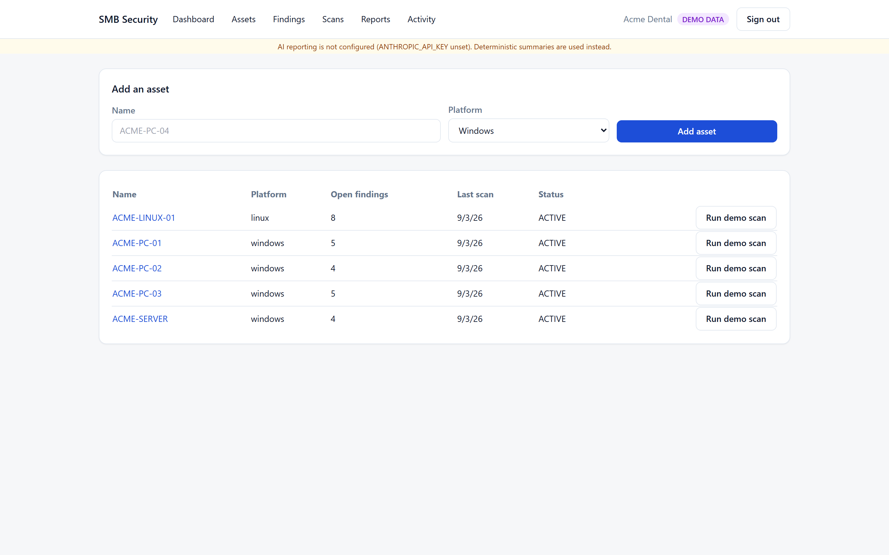
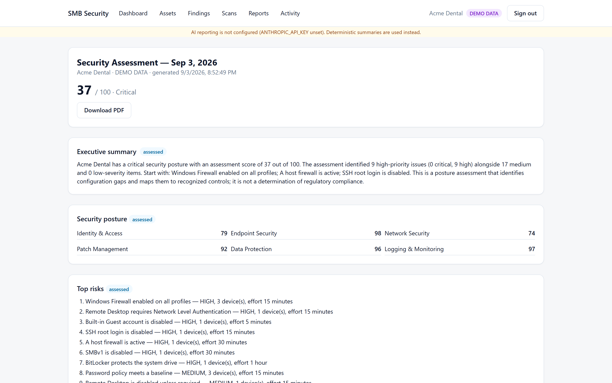

# SMB Security Posture & Compliance Readiness Platform

A lightweight security assessment platform for small businesses that don't have
dedicated cybersecurity staff. It runs read-only configuration checks against
Windows and Linux endpoints, scores the results with a deterministic risk model,
maps gaps to recognized security controls (CIS Controls, NIST CSF), explains them
in plain English, and verifies fixes on re-scan.

> **Positioning.** This is a **security posture assessment and compliance
> readiness** tool. It identifies configuration gaps and maps them to recognized
> security controls. It does **not** make legal or regulatory compliance
> determinations, and no report it produces is an audit or certification.

## Screenshots

Captured from the built-in demo organization (**Acme Dental**, all data tagged
`DEMO DATA`). Regenerate with `node apps/web/scripts/demo-screenshots.mjs`
against a running instance.



| Findings | Finding detail |
| --- | --- |
|  |  |

| Assets | Assessment report |
| --- | --- |
|  |  |

## Project status

Runnable MVP. Verified end-to-end against PostgreSQL:

- **Core packages** — `shared`, `checks` (26 read-only Windows/Linux checks),
  `risk-engine` (deterministic scoring), `compliance` (CIS v8 + NIST CSF 2.0
  mapping), `ai` (Anthropic explanation layer with guardrails + graceful
  fallback), `scanner`.
- **Scanner CLI** (`security-agent`) — verified running against a real Windows host.
- **Web app** — auth, tenant isolation, the scan-ingestion trust boundary,
  deterministic scoring + prioritization, finding lifecycle with verify-on-rescan,
  CIS/NIST alignment, demo mode, AI explanations (degrade gracefully), reports +
  PDF, audit log.
- **Tests** — 105 passing: 86 unit (packages) + 11 lifecycle + 8 integration/security
  (tenant isolation, malformed scan, unknown checkId, forged severity ignored,
  detect→re-scan→resolved→score-up, regression reopen, no demo/real mixing).
- **E2E** — the Playwright golden path (signup → asset → scan → score → finding →
  re-scan → resolved → score change → report → PDF → history) passes.
- `pnpm typecheck`, `pnpm lint`, `next build` all green.

Known gaps: password-reset email delivery is stubbed (token flow exists); the
in-memory rate limiter is per-instance; no 2FA. See
[`docs/DEVELOPMENT.md`](docs/DEVELOPMENT.md).

## The product loop

**Discover → Assess → Prioritize → Explain → Remediate → Verify → Report**

| Stage | What it does |
| --- | --- |
| Discover | Register endpoints (assets) for an organization. |
| Assess | Run the scanner (real local scan or demo scan); ingest structured JSON. |
| Prioritize | Deterministic risk + remediation-priority engine surfaces "fix these first". |
| Explain | Deterministic remediation guidance, optionally narrated by Claude. |
| Remediate | Human-guided fixes with a "who should handle it" + effort estimate. |
| Verify | Re-scan re-checks the exact configuration; findings move OPEN → RESOLVED. |
| Report | Professional assessment report (online + PDF) with a clear disclaimer. |

## Architecture

Modular monolith. No microservices, no Kubernetes, no queues.

```
apps/
  web/            Next.js dashboard + authenticated API + Prisma/PostgreSQL
packages/
  shared/         Types + Zod schemas (scan-result schema is the trust boundary)
  checks/         SecurityCheck definitions + registry (authoritative severity)
  scanner/        Read-only collectors + `security-agent` CLI (Windows/Linux)
  risk-engine/    Deterministic scoring + remediation prioritization
  compliance/     CIS / NIST CSF control mappings (curated SMB subset)
  ai/             Anthropic client, prompt construction, output guardrails
```

See [`docs/ARCHITECTURE.md`](docs/ARCHITECTURE.md).

## Quick start

### Option A — Docker (recommended)

Needs **Docker Desktop** (with virtualization enabled) or Docker Engine + Compose v2.

```bash
git clone https://github.com/r00tRyan/SMB-compliance-tool.git
cd SMB-compliance-tool
cp .env.example .env

# Set a real session secret (any 32+ random bytes):
#   Linux/macOS:  openssl rand -base64 32
#   Windows PS:   [Convert]::ToBase64String((1..32|%{Get-Random -Max 256}))
# Paste it as AUTH_SECRET in .env. ANTHROPIC_API_KEY is optional.

docker compose up --build          # Postgres + web; migrations + demo seed run on first boot
```

Open **http://localhost:3000**. Sign in with the demo credentials from `.env`
(`owner@acmedental.example` / `demo-password-local-only`) or register a new
organization.

Stop with `docker compose down` (add `-v` to also wipe the database).

### Option B — without Docker

Needs **Node 20.11+**, **pnpm 11+** (`npm i -g pnpm`), and a **PostgreSQL 14+** instance.

```bash
git clone https://github.com/r00tRyan/SMB-compliance-tool.git
cd SMB-compliance-tool
pnpm install
cp .env.example .env
# edit .env: point DATABASE_URL at your Postgres, set a real AUTH_SECRET
pnpm --filter @smb/web db:migrate        # creates the schema
pnpm --filter @smb/web db:seed           # optional: demo data (needs ENABLE_DEMO_SEED=true)
pnpm dev                                  # http://localhost:3000
```

> **Do not expose this to an untrusted network as-is.** It serves over plain
> HTTP and has no TLS, agent authentication, or 2FA. It's built for localhost /
> a trusted LAN / behind your own reverse proxy. Always replace the default
> `AUTH_SECRET`.

## Running a real scan

```bash
pnpm --filter @smb/scanner build
node packages/scanner/dist/cli.js scan --output result.json
# then upload result.json in the dashboard, or POST it to /api/scans
```

See [`docs/SCANNER.md`](docs/SCANNER.md) and [`docs/CHECKS.md`](docs/CHECKS.md).

## Demo mode

`ENABLE_DEMO_SEED=true` + `pnpm db:seed` creates the fictional **Acme Dental**
organization (5 assets, realistic findings). All demo data is tagged `DEMO DATA`
and is never mixed with real scan results. See [`docs/DEVELOPMENT.md`](docs/DEVELOPMENT.md).

## Anthropic configuration

Set `ANTHROPIC_API_KEY` in `.env`. AI is an **explanation/reporting layer only** —
it never determines findings, severity, or control mappings, and the app is fully
functional without it. See [`docs/AI.md`](docs/AI.md).

## Documentation

| Doc | Contents |
| --- | --- |
| [ARCHITECTURE.md](docs/ARCHITECTURE.md) | System design, package boundaries, data flow |
| [SECURITY.md](docs/SECURITY.md) | Security controls, reporting a vulnerability |
| [THREAT_MODEL.md](docs/THREAT_MODEL.md) | Threats + mitigations |
| [API.md](docs/API.md) | Authenticated HTTP API reference |
| [DEVELOPMENT.md](docs/DEVELOPMENT.md) | Local setup, demo mode, testing |
| [SCANNER.md](docs/SCANNER.md) | Scanner CLI, safety boundaries, output format |
| [CHECKS.md](docs/CHECKS.md) | Every security check, rationale, remediation |
| [AI.md](docs/AI.md) | AI integration, prompts, guardrails, failure handling |
| [REPORTING.md](docs/REPORTING.md) | Report structure, integrity model, PDF export |

## Security

This app stores configuration-weakness data about endpoints; treat it as
sensitive. Controls implemented (server-side authz, tenant isolation, Argon2id,
CSP/HSTS, registry-authoritative severity, AI prompt-injection defense, …) and
how to report a vulnerability are in [`docs/SECURITY.md`](docs/SECURITY.md) and
[`docs/THREAT_MODEL.md`](docs/THREAT_MODEL.md).

## License

[MIT](LICENSE) © r00tRyan. Provided as-is, with no warranty. This tool performs
**posture assessment**, not a legal or regulatory compliance determination.
